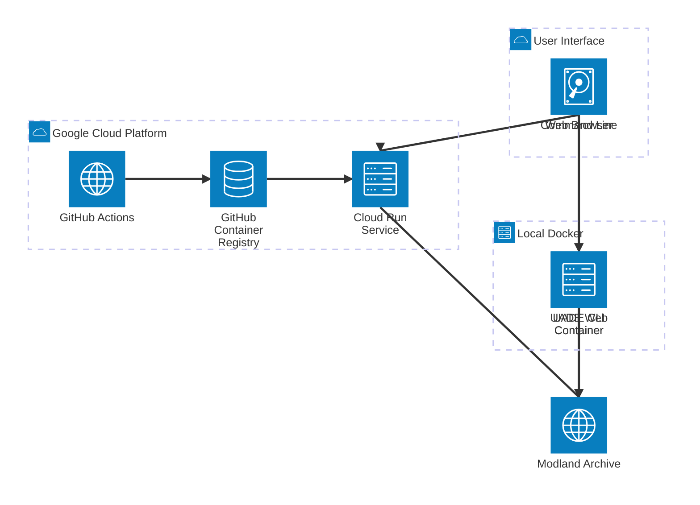

# UADE Docker - System Architecture

This document describes the architecture of the UADE Docker system, showing both the CLI and Web Player deployments.

## System Architecture Diagram

## Components

### User Interface Layer

- **Web Browser** - Access web player via HTTPS
- **Command Line** - Run Docker commands locally via PowerShell/Bash

### Local Docker Layer

- **UADE CLI Container** (`uade-cli`)
  - Debian stable-slim base
  - UADE player compiled from source
  - Command-line interface for module conversion
  - Non-root user (uid=1000)

- **UADE Web Container** (`uade-web-player`)
  - Multi-stage build using UADE CLI as base
  - Flask web application + Gunicorn
  - Python 3 with virtual environment
  - Supports file upload and URL downloads
  - Automatic extraction of LHA and ZIP archives (finds and plays first music file inside)
  - Non-root user (uid=1000)
  - Rate limiting (per endpoint & global, per instance)

### Google Cloud Platform Layer

- **GitHub Actions**
  - Automated CI/CD pipeline
  - Builds Docker images on push to main
  - Change detection for UADE base caching
  - Runs tests and health checks

- **GitHub Container Registry (GHCR)**

  - Stores built Docker images
  - UADE base image cached for faster builds
  - Web player image with git commit tags

- **Cloud Run Service**

  - Serverless container deployment
  - Auto-scaling (0-10 instances)
  - Minimal service account (zero permissions)
  - gVisor sandbox isolation
  - 2Gi memory, 2 CPU, 300s timeout

### External Services

- **Modland Archive**
  - HTTP access to module database
  - Protracker, TFMX, AHX formats
  - Direct download support

## Data Flow

### CLI Workflow

1. User runs Docker command with module file
2. UADE CLI container processes module
3. Converts to WAV/FLAC format
4. Outputs to mounted volume
5. User plays converted file locally

### Web Player Workflow

1. User uploads module or provides URL
2. Flask server receives request
3. For URL requests, calculates MD5 hash of the URL and checks if the file is already cached
4. If cached, uses the local file; if not, downloads and caches the file using the hash
5. If file is an LHA or ZIP archive, automatically extracts and finds first supported music file
6. Calls UADE player subprocess
7. Converts to WAV or FLAC
8. Streams audio back to browser
9. Cleans up temporary files and symlinks (1 hour TTL)

### Deployment Workflow

1. Developer pushes code to GitHub
2. GitHub Actions triggered
3. Checks if UADE base needs rebuild
4. Builds web player image (with caching)
5. Pushes to Container Registry
6. Deploys to Cloud Run
7. Runs health check validation

## Security Model

### Container Security

- Non-root user (uid=1000) in all containers
- Minimal base images (Debian stable-slim)
- No shell=True in subprocess calls
- Read-only application directory
- Writable temp directories only

### Cloud Run Security

- Minimal service account with zero IAM roles
- gVisor sandbox isolation
- No GCP API access
- HTTPS only with managed certificates
- Max 10 instances (DoS protection)
- Budget alerts at $1/month

### Application Security

- UUID-based filenames (path traversal prevention)
- File size limits (10MB uploads)
- Process timeouts (300s max)
- Automatic file cleanup
- Input validation and sanitization
- Zero HIGH severity security issues (Bandit, ESLint)

## Technology Stack

### Backend

- **Language:** Python 3
- **Framework:** Flask 3.0.0
- **Server:** Gunicorn 21.2.0
- **Audio Processing:** UADE player, FLAC encoder

### Frontend

- **Language:** JavaScript (ES6+)
- **Styling:** CSS3 with Protracker theme
- **Icons:** Protracker favicon

### Infrastructure

- **Container Runtime:** Docker
- **Orchestration:** Docker Compose (local), Cloud Run (Web Runtime)
- **CI/CD:** GitHub Actions
- **Registry:** GitHub Container Registry
- **Cloud Provider:** Google Cloud Platform
- **Remote Cache Support:**
  - Stateless cache for converted files can use local disk, AWS S3, or Google Cloud Storage
  - Uses fsspec, s3fs, and gcsfs for unified access
  - Docker image and local development require these Python dependencies for remote cache
  - Multi-instance deployments share cache for instant replay and deduplication

### Development

- **Linting:** Black (Python), ESLint (JS), Hadolint (Docker), Prettier (All)
- **Security:** Bandit, W3C Validator
- **Version Control:** Git, GitHub
- **Documentation:** Markdown, Mermaid

## Performance Optimizations

### Docker Build

- Multi-stage builds
- Layer caching with `--cache-from`
- UADE base image caching
- Change detection (only rebuild when needed)
- `.dockerignore` excludes test files

### Application

- Single Gunicorn worker (memory optimization)
- 4 threads per worker
- Connection pooling
- Temporary file cleanup (hourly)
- URL-based caching: Downloads from URLs are cached (including TFMX sample) using an MD5 hash of the URL. If a file has already been downloaded, it is reused from the cache, reducing bandwidth and improving performance.
- Cache directory for downloads (can be local or remote S3/GCS, see Infrastructure)

### Cloud Run

- Auto-scaling from 0 to 10 instances
- 2Gi memory allocation
- 2 CPU allocation
- Keep-alive connections (5s)
- Graceful shutdown (300s)

## Monitoring

- Cloud Run logs (errors, requests)
- Health endpoint (`/health`)
- Git commit tracking in responses
- Budget alerts
- Network egress monitoring (1GB free tier)

## Rate Limiting

UADE Web Player enforces rate limits to prevent abuse and ensure fair usage:

- Conversion endpoints: 10 requests/min per IP
- Play endpoints: 50 requests/min per IP
- Download endpoint: 3 requests/min per IP
- Global limit: 200 requests/hour per IP (all endpoints combined)

> Rate limits are enforced per instance/pod. For global limits across all instances, a distributed backend (e.g., Redis) is required.
