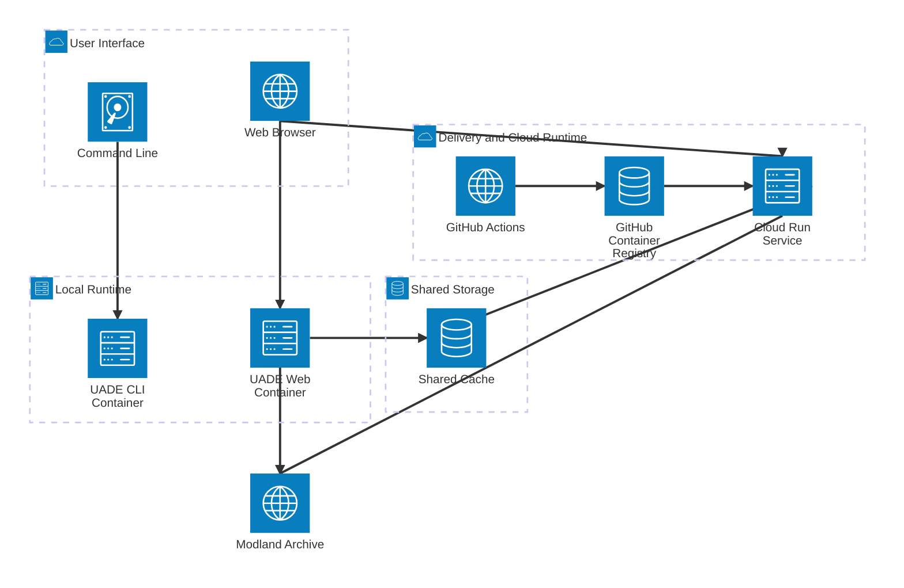

# UADE Docker - System Architecture

This document describes the architecture of the UADE Docker system, showing both the CLI and Web Player deployments.

## System Architecture Diagram

```mermaid
architecture-beta
    group user(cloud)[User Interface]
    group local(server)[Local Runtime]
    group delivery(cloud)[Delivery and Cloud Runtime]
    group storage(database)[Shared Storage]

    service browser(internet)[Web Browser] in user
    service cli(disk)[Command Line] in user

    service docker_cli(server)[UADE CLI Container] in local
    service docker_web(server)[UADE Web Container] in local

    service github(internet)[GitHub Actions] in delivery
    service ghcr(database)[GitHub Container Registry] in delivery
    service cloudrun(server)[Cloud Run Service] in delivery
    service shared_cache(database)[Shared Cache] in storage

    service modland(internet)[Modland Archive]

    browser:B --> T:cloudrun
    cli:B --> T:docker_cli
    browser:B --> T:docker_web

  github:R --> L:ghcr
  ghcr:R --> L:cloudrun

    cloudrun:B --> T:modland
    cloudrun:R --> L:shared_cache
    docker_web:B --> T:modland
    docker_web:R --> L:shared_cache
```

## Components

### User Interface Layer

- **Web Browser** - Access web player via HTTPS
- **Command Line** - Run Docker commands locally via PowerShell/Bash

### Local Runtime (Docker) Layer

- **UADE CLI Container** (`uade-cli`)
  - Debian stable-slim base
  - UADE player compiled from source
  - Command-line interface for module conversion
  - Non-root user (uid=1000)

- **UADE Web Container** (`uade-web-player`)
  - Multi-stage build using UADE CLI as base
  - Flask web application + Gunicorn
  - Python 3 with virtual environment
  - Supports file upload and URL downloads
  - Automatic extraction of LHA and ZIP archives (finds and plays first music file inside)
  - Non-root user (uid=1000)
  - Rate limiting (per endpoint & global, per instance)

### Delivery and Cloud Runtime Layer

- **GitHub Actions**
  - Automated CI/CD pipeline
  - Builds Docker images on push to main
  - Change detection for UADE base caching
  - Runs tests and health checks

- **GitHub Container Registry (GHCR)**

  - Stores built Docker images
  - UADE base image cached for faster builds
  - Web player image with git commit tags

- **Cloud Run Service**

  - Serverless container deployment
  - Auto-scaling (0-10 instances)
  - Minimal service account (zero permissions)
  - gVisor sandbox isolation
  - 2Gi memory, 2 CPU, 300s timeout

### Shared Storage Layer

- **Shared Cache**
  - Converted-audio cache backed by local disk, AWS S3, or Google Cloud Storage
  - Shared across web instances when `CACHE_URI` points to a shared backend
  - Used for instant replay, deduplication, and multi-instance cache recovery

### External Services

- **Modland Archive**
  - HTTP access to module database
  - Protracker, TFMX, AHX formats
  - Direct download support

## Data Flow

### CLI Workflow

1. User runs Docker command with module file
2. UADE CLI container processes module
3. Converts to WAV/FLAC format
4. Outputs to mounted volume
5. User plays converted file locally

### Web Player Workflow

The UI uses four request patterns:

1. **Direct local-file play:** `/upload`
2. **Direct URL play:** `/convert-url`
3. **Queued local-file play:** `/probe-upload`, then `/convert-probed` as an optimization, with `/upload` fallback
4. **Queued URL play:** `/probe-url`, then `/convert-url`
5. **Playback:** successful conversion responses return a `file_id`, and the browser plays the resulting audio via `/play/{file_id}`

In every conversion path, the backend checks the main **server-side cache** for converted WAV/FLAC audio using the module content hash, converts if needed, then returns browser-cacheable audio. For URL-based requests, the downloaded source file is also checked in a container-local disk cache keyed by URL before re-download. Browser-side cache only works when that exact WAV or FLAC response has already been cached for the same playback URL. Temporary files are cleaned up periodically.

### Cache Matrix

The backend read path for `/play/*` is:

1. Check the serving container's local converted-file directory.
2. If the file is not local, try the shared cache (`CACHE_URI`).
3. If neither source has the file, return `404`.

This means cache behavior in multi-instance setups is best understood with the following matrix:

| Serving container local converted file | Shared cache artifact | Expected `/play/*` result | Notes |
| --- | --- | --- | --- |
| Present | Present | Serve audio (`200` or `206`) | Local disk wins; shared cache is not needed. |
| Present | Missing | Serve audio (`200` or `206`) | A warmed instance can continue serving from its own local disk. |
| Missing | Present | Serve audio (`200` or `206`) | Backend fetches from shared cache and can materialize a fresh local copy. |
| Missing | Missing | `404` | No playable source remains. |

For queue playback using local files:

| Probed source on serving container | Shared converted audio already exists | Expected `/convert-probed` result | Expected fallback |
| --- | --- | --- | --- |
| Present | Either | Success (`200`) | No fallback needed. |
| Missing | Present or missing | `404` | Client should fall back to `/upload` if the original local file is still available in the browser session. |

This is why `/convert-probed` is documented as a best-effort optimization rather than a cross-instance durability guarantee. The shared cache is the important stateless guarantee for converted audio; the probed local source file is still container-local by default.

### Deployment Workflow

1. Developer pushes code to GitHub
2. GitHub Actions triggered
3. Checks if UADE base needs rebuild
4. Builds web player image (with caching)
5. Pushes to Container Registry
6. Deploys to Cloud Run
7. Runs health check validation

## Security Model

### Container Security

- Non-root user (uid=1000) in all containers
- Minimal base images (Debian stable-slim)
- No shell=True in subprocess calls
- Read-only application directory
- Writable temp directories only

### Cloud Run Security

- Minimal service account with zero IAM roles
- gVisor sandbox isolation
- No GCP API access
- HTTPS only with managed certificates
- Max 10 instances (DoS protection)
- Budget alerts at $1/month

### Application Security

- UUID-based filenames (path traversal prevention)
- File size limits (10MB uploads)
- Process timeouts (300s max)
- Automatic file cleanup on write-oriented requests
- Input validation and sanitization
- Zero HIGH severity security issues (Bandit, ESLint)

### CI/CD

- **Code Quality Checks:** Automated quality checks run on every push and pull request.
- **Dependency Review:** Pull requests are checked for vulnerable dependencies before merge.
- **SAST:** CodeQL, Semgrep, and Bandit provide static security analysis in CI.
- **Container Scanning:** Trivy and Hadolint cover container and Dockerfile security hygiene.
- For the maintained tool list, commands, and workflow details, see [`CODE-QUALITY.md`](CODE-QUALITY.md).
- **Dependabot**: Automatically monitors and updates Docker, Pip, and GitHub Actions dependencies with security patches.

## Dynamic Application Security Testing (DAST)

### OWASP ZAP Integration

- **Manual DAST:** DAST scans are not run automatically in CI/CD pipelines. Developers must manually run OWASP ZAP using docker compose:
  - Baseline scan: `docker compose run --rm --build zap-scan`
  - Full scan: `docker compose run --rm --build zap-full-scan`
  - Seeded baseline scan: `docker compose run --rm --build zap-scan-seeded`
  - Seeded full scan: `docker compose run --rm --build zap-full-scan-seeded`
  - The HTML report will be generated in the `./reports` directory.
- **Scope:** Plain scans target the running `uade-web` service for common web vulnerabilities (XSS, CSRF, authentication flaws, misconfigurations).
- **Seeded Coverage:** Seeded scans use a dedicated `uade-web-seeded` service with local-only fixture access enabled so ZAP can exercise non-crawlable POST endpoints and backend negative cases.
- **Exclusions:** Health endpoints and static assets are excluded from scans to reduce noise.
- **Exit Codes:** ZAP exit code `2` means the scan completed with warnings; it is not, by itself, an infrastructure failure.
- **Remediation:** All detected vulnerabilities should be triaged and resolved before production deployment. Critical and high findings must block releases.
- For the maintained developer workflow wording, see [`WEB-PLAYER.md`](WEB-PLAYER.md) and [`CODE-QUALITY.md`](CODE-QUALITY.md).

## Concurrency Testing

- **Manual Stress and Concurrency Testing:** Concurrency tests are not run automatically in CI/CD pipelines. Developers must manually run the race condition test using docker-compose:
  - Run: `docker compose run --rm --build uade-test-race-condition-runner`
  - This executes the custom shell script `test/test_race_condition.sh`, which fires multiple simultaneous requests to the conversion endpoint and checks for race conditions.
- **Race Condition Defense:** All conversion logic uses atomic file locks and double-checked caching to prevent race conditions and ensure correct results under load.

## Technology Stack

### Backend

- **Language:** Python 3.13
- **Framework:** Flask 3.1.3
- **Server:** Gunicorn 26.1.0
- **Audio Processing:** UADE player, FLAC encoder

### Frontend

- **Language:** JavaScript (ES6+)
- **Styling:** CSS3 with Protracker theme
- **Icons:** Protracker favicon
- **Mobile lock screen integration:** Media Session API

### Infrastructure

- **Container Runtime:** Docker
- **Orchestration:** Docker Compose (local), Cloud Run (Web Runtime)
- **CI/CD:** GitHub Actions
- **Registry:** GitHub Container Registry
- **Cloud Provider:** Google Cloud Platform
- **Server-Side Cache Support:**
  - Stateless cache for converted files can use local disk, AWS S3, or Google Cloud Storage
  - Uses fsspec, s3fs, and gcsfs for unified access
  - Docker image and local development require Python dependencies (see `requirements.txt`)
  - Multi-instance deployments share cache for instant replay and deduplication
  - Remote-cache LRU tracking uses a sidecar access record per cache hash (`HASH.cache-access.json`)
    so cache-hit access times work consistently across `file`, `s3`, and `gcs` backends

### Development

- **Code Quality:** ESLint, Stylelint, HTMLHint (versions managed in `test/package.json`), Black, Ruff, mypy, Yamllint (versions managed in `test/requirements-quality.txt`), Hadolint and ActionLint Docker tags (managed in `test/docker-compose.tooling.yml`), ShellCheck (Shell), and Docker Compose validation
- **Security:** Bandit, Semgrep, CodeQL, Trivy
- **Version Control:** Git, GitHub
- **Documentation:** Markdown, Mermaid

## Performance Optimizations

### Docker Build

- Multi-stage builds
- Layer caching with `--cache-from`
- UADE base image caching
- Change detection (only rebuild when needed)
- `.dockerignore` excludes test files

### Application

- **Client-Side Caching:** Converted audio responses are browser-cacheable for one month, enabling instant playback on repeat visits when the exact WAV/FLAC artifact URL is already cached.
- **Server-Side Caching:**
  - Source modules from URLs are cached locally to prevent re-downloads (using an MD5 hash of the URL).
  - Converted audio files are stored in a content-addressable cache (local or remote S3/GCS, see Infrastructure) for deduplication and instant serving.
  - Remote cache cleanup prefers sidecar `last_accessed_at` timestamps over backend object mtimes,
    with object mtime used as fallback when a sidecar is missing.
  - Remote cache cleanup preserves managed cache subdirectories such as `conversion-locks`;
    cleanup may remove expired `*.lock` files inside them, but the directories themselves
    hold coordination state rather than removable audio artifacts.
- Single Gunicorn worker (memory optimization)
- 4 threads per worker
- Connection pooling
- Temporary file cleanup on eligible requests after the configured interval
  - Local files older than `CLEANUP_INTERVAL` are purged by a request-triggered cleanup pass.
  - Cleanup runs at most once per interval per process, is serialized with a lock, and skips `/play/*` and `/download/*` requests.

### Cloud Run

- Auto-scaling from 0 to 10 instances
- 2Gi memory allocation
- 2 CPU allocation
- Keep-alive connections (5s)
- Graceful shutdown (300s)

## Monitoring

- Cloud Run logs (errors, requests)
- **Health endpoint (`/health`)**: Returns comprehensive runtime information:
  - System status and uptime
  - Resource usage (Memory, Disk space)
  - Dependency verification (uade123, flac, lha, unzip availability)
  - Environment details (Python version, OS platform)
  - Redacted configuration and cache settings
  - Optional cache debug timing summaries (`oldest_entry_at`, `newest_entry_at`,
    `oldest_accessed_at`, `newest_accessed_at`) when `HEALTH_INCLUDE_CACHE_DEBUG=1`
- Git commit tracking in responses
- Budget alerts
- Network egress monitoring (1GB free tier)

## Rate Limiting

UADE Web Player enforces per-endpoint and global rate limits to prevent abuse and ensure fair usage using Flask-Limiter.

For the exact current limits (conversions, play endpoints, downloads, etc.), see the **[Rate Limiting section in the Web Player Documentation](WEB-PLAYER.md#rate-limiting)**.

> Rate limits are enforced per instance/pod. For global limits across all instances, a distributed backend (e.g., Redis) is required.
