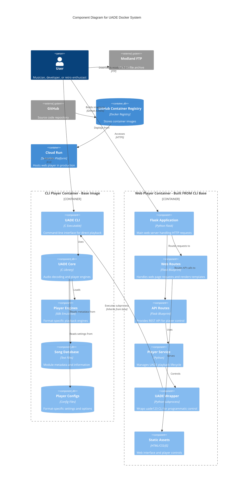

# UADE Docker System - Component Diagram

This document provides a detailed component-level view of the UADE Docker system, showing the internal structure of the web player and CLI player containers.

## Component Diagram

## Component Descriptions

### Base Image: CLI Player Container

The CLI Player Container serves as the base image that contains all core UADE components. It can be used standalone for command-line playback or as the foundation for the web player.

#### UADE CLI

- **Technology**: C executable (uade123)
- **Responsibilities**:
  - Command-line argument parsing
  - Direct audio output (ALSA/PulseAudio)
  - Batch processing support
  - Terminal output formatting
  - Audio streaming to stdout for web player

#### UADE Core

- **Technology**: C library
- **Responsibilities**:
  - Audio decoding algorithms
  - Format-specific parsing
  - DSP effects (filters, panning)
  - Sample rate conversion

#### Player Engines

- **Technology**: 68000 emulation + player code
- **Responsibilities**:
  - Execute original player routines
  - Emulate Amiga hardware behavior
  - Support 40+ module formats
  - Maintain format-specific quirks

#### Song Database

- **Technology**: Plain text files
- **Responsibilities**:
  - Store module metadata
  - Provide song names and artist info
  - Map files to composers
  - Support lookup by hash

#### Player Configs

- **Technology**: INI-style config files
- **Responsibilities**:
  - Format-specific settings
  - Player engine parameters
  - Default subsong selection
  - Filter and effect settings

### Web Player Components (Built FROM CLI Base)

The Web Player Container is built using multi-stage Docker build with `FROM uade-cli` as the base, adding Flask web server and Python components on top of the complete UADE CLI installation.

#### Flask Application

- **Technology**: Python Flask web framework
- **Responsibilities**:
  - HTTP server and request routing
  - Session management
  - Error handling and logging
  - Integration with Gunicorn for production

#### Web Routes

- **Technology**: Flask Blueprint
- **Responsibilities**:
  - Serve main player interface (`/`)
  - Provide metadata endpoints (`/songinfo`)
  - Handle file uploads (`/upload`)
  - Render Jinja2 templates

#### API Routes

- **Technology**: Flask Blueprint (REST API)
- **Responsibilities**:
  - Play control (`/api/play`, `/api/stop`)
  - Playback status (`/api/status`)
  - File management (`/api/list`)
  - JSON response formatting

#### Player Service

- **Technology**: Python service layer
- **Responsibilities**:
  - Manage playback state machine
  - Handle concurrent playback requests
  - Process management and cleanup
  - Error handling and recovery

#### UADE Wrapper

- **Technology**: Python subprocess wrapper
- **Responsibilities**:
  - Launch uade123 CLI process (inherited from base image)
  - Parse output and status
  - Stream audio data
  - Process lifecycle management

#### Static Assets

- **Technology**: HTML5, CSS3, JavaScript
- **Responsibilities**:
  - Responsive web interface
  - Audio player controls
  - Real-time status updates
  - File upload interface

## Technology Stack

### CLI Player Stack (Base Image)

- **Runtime**: Debian 12 Slim
- **Audio Engine**: UADE 3.03
- **Libraries**: ALSA, libao, libsndfile
- **Shell**: Bash helper scripts
- **Components**: uade123 binary, player engines, song database, configs

### Web Player Stack (Built FROM CLI Base)

- **Base**: CLI Player Container (inherits all UADE components)
- **Frontend**: HTML5, CSS3, Vanilla JavaScript
- **Backend**: Python 3.11, Flask 3.0
- **Server**: Gunicorn 21.2 (4 workers)
- **Container**: Multi-stage build (FROM uade-cli)
- **Additional Components**: Flask app, static assets, Python wrapper

## Data Flow

### Docker Build Flow

1. Stage 1: Build CLI Player Container (Dockerfile)
   - Install UADE dependencies and build tools
   - Compile UADE from source
   - Configure player engines and metadata
   - Create base image with uade123 binary

2. Stage 2: Build Web Player Container (Dockerfile.web)
   - FROM uade-cli base image (inherits all UADE components)
   - Install Python and Flask dependencies
   - Copy web application code and templates
   - Configure Gunicorn web server
   - Expose port 8080 for HTTP traffic

### Web Player Request Flow

1. User accesses web interface via browser
2. Flask serves static HTML/CSS/JS
3. User uploads or selects module file
4. API endpoint receives play request
5. Player Service validates and queues request
6. UADE Wrapper spawns uade123 process (from base image)
7. uade123 decodes audio stream using UADE Core
8. Audio data streamed back to browser
9. Status updates via API polling

### CLI Player Execution Flow

1. User mounts volume with module files
2. PowerShell script invokes Docker container
3. Container executes uade123 directly
4. UADE CLI loads module file
5. UADE Core detects format and loads player
6. Player Engine executes on 68k emulator
7. Audio output to Docker host audio device

## Architecture Benefits

### Multi-Stage Build Advantages

- **Code Reuse**: Web player inherits complete CLI functionality
- **Consistency**: Both containers use identical UADE binaries
- **Smaller Images**: Shared base layer reduces total storage
- **Simplified Updates**: UADE updates only need to modify base image
- **Testing**: CLI container can test UADE before web deployment

### Layered Architecture

- **Separation of Concerns**: Audio engine separate from web interface
- **Independent Scaling**: CLI and web can scale differently
- **Flexibility**: Can deploy CLI-only or full web player
- **Development**: Test audio separately from web layer

## Security Model

### CLI Player Security (Base Layer)

- **User Context**: Non-root user (uadeuser:1000)
- **File System**: Read-only recommended for module volumes
- **Network**: No network access required
- **Capabilities**: No elevated privileges

### Web Player Security (Additional Layer)

- **Inherited Security**: All CLI security measures apply
- **Process Isolation**: UADE runs as subprocess
- **File System**: Read-only modules directory
- **Network**: Minimal attack surface (HTTP only)
- **Resource Limits**: Memory and CPU constraints

## Performance Characteristics

### CLI Player Performance (Base)

- **Container Start**: <1 second
- **Playback Start**: <100ms
- **Memory**: ~50MB footprint
- **CPU**: Single-threaded (1 core)

### Web Player Performance (CLI Base + Flask)

- **Cold Start**: ~2-3 seconds (Cloud Run)
- **Playback Start**: 100-500ms (includes Flask overhead)
- **Concurrent Users**: 4 workers support 20-40 users
- **Memory**: ~150MB per worker (~100MB Flask + ~50MB UADE)
- **CPU**: Minimal (mostly I/O wait)

## Monitoring and Observability

### CLI Player Observability

- **Logs**: Docker container logs
- **Debug**: UADE verbose output (-v)
- **Performance**: Time command integration

### Web Player Metrics

- **Logs**: Cloud Logging (structured JSON)
- **Metrics**: Container resource usage
- **Tracing**: Request/response timing
- **Health**: `/api/status` endpoint

## Deployment Architecture

### Multi-Stage Build Process

1. **Stage 1 - CLI Base Image** (Dockerfile)
   - Build UADE from source
   - Install player engines and metadata
   - Create standalone CLI player image
   - Can be deployed independently

2. **Stage 2 - Web Player Image** (Dockerfile.web)
   - Use `FROM uade-cli` to inherit base
   - Add Python, Flask, and web dependencies
   - Copy web application code
   - Configure Gunicorn server
   - Deploy to Cloud Run

### CI/CD Pipeline

1. Code pushed to GitHub
2. GitHub Actions triggers on main branch
3. Build CLI base image (stage 1)
4. Build web player image FROM CLI base (stage 2)
5. Security scanning (Hadolint)
6. Push both images to Google Container Registry
7. Deploy web player to Cloud Run

### Container Deployment

- **CLI Player**: Local Docker engine, standalone image
- **Web Player**: Cloud Run (serverless), built FROM CLI base
- **Registry**: GitHub Container Registry (ghcr.io)
- **Automation**: GitHub Actions workflows
- **Image Relationship**: Web image depends on CLI image
