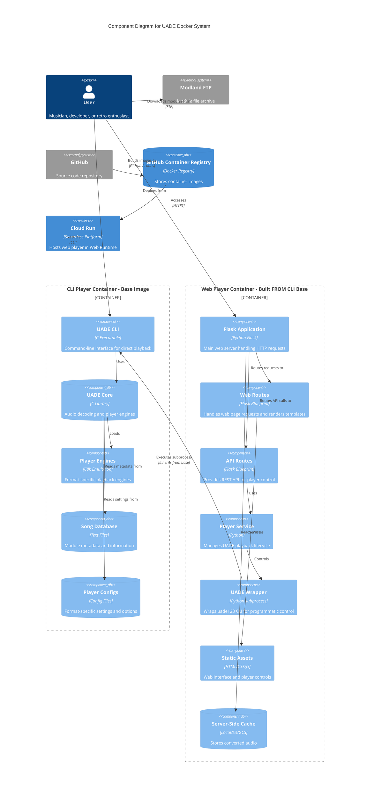

# UADE Docker System - Component Diagram

This document provides a detailed component-level view of the UADE Docker system, showing the internal structure of the web player and CLI player containers.

## Component Diagram

```mermaid
C4Component
title Component Diagram for UADE Docker System

Person(user, "User", "Musician, developer, or retro enthusiast")
System_Ext(modland, "Modland FTP", "Module file archive")
System_Ext(github, "GitHub", "Source code repository")

Container_Boundary(cli_container, "CLI Player Container - Base Image") {
    Component(uade_cli, "UADE CLI", "C Executable", "Command-line interface for direct playback")
    ComponentDb(uade_core, "UADE Core", "C Library", "Audio decoding and player engines")
    Component(player_engines, "Player Engines", "68k Emulation", "Format-specific playback engines")
    ComponentDb(song_db, "Song Database", "Text Files", "Module metadata and information")
    ComponentDb(player_configs, "Player Configs", "Config Files", "Format-specific settings and options")
}

Container_Boundary(web_container, "Web Player Container - Built FROM CLI Base") {
    Component(flask_app, "Flask Application", "Python Flask", "Main web server handling HTTP requests")
    Component(web_routes, "Web Routes", "Flask Blueprint", "Handles web page requests and renders templates")
    Component(api_routes, "API Routes", "Flask Blueprint", "Provides REST API for player control")
    Component(player_service, "Player Service", "Python", "Manages UADE playback lifecycle")
    Component(uade_wrapper, "UADE Wrapper", "Python subprocess", "Wraps uade123 CLI for programmatic control")
    Component(static_files, "Static Assets", "HTML/CSS/JS", "Web interface and player controls")
    ComponentDb(cache, "Server-Side Cache", "Local/S3/GCS", "Stores converted audio")
}

ContainerDb(ghcr, "GitHub Container Registry", "Docker Registry", "Stores container images")
Container(cloudrun, "Cloud Run", "Serverless Platform", "Hosts web player in Web Runtime")

Rel(user, flask_app, "Accesses", "HTTPS")
Rel(user, uade_cli, "Executes", "CLI")

Rel(flask_app, web_routes, "Routes requests to")
Rel(flask_app, api_routes, "Routes API calls to")
Rel(flask_app, cache, "Reads/Writes")
Rel(web_routes, static_files, "Serves")
Rel(api_routes, player_service, "Uses")
Rel(player_service, uade_wrapper, "Controls")
Rel(uade_wrapper, uade_cli, "Executes subprocess", "Inherits from base")

Rel(uade_cli, uade_core, "Uses")
Rel(uade_core, player_engines, "Loads")
Rel(uade_core, song_db, "Reads metadata from")
Rel(uade_core, player_configs, "Reads settings from")

Rel(user, modland, "Downloads modules from", "FTP")
Rel(github, ghcr, "Builds images to", "GitHub Actions")
Rel(ghcr, cloudrun, "Deploys from")

UpdateRelStyle(user, flask_app, $offsetY="-60")
UpdateRelStyle(user, uade_cli, $offsetX="-120", $offsetY="60")
UpdateRelStyle(flask_app, web_routes, $offsetX="-40")
UpdateRelStyle(flask_app, api_routes, $offsetX="40")
UpdateRelStyle(api_routes, player_service, $offsetY="-20")
UpdateRelStyle(player_service, uade_wrapper, $offsetY="-20")
UpdateRelStyle(uade_wrapper, uade_cli, $offsetY="-30", $offsetX="-80", $textColor="red", $lineColor="red")
UpdateRelStyle(uade_cli, uade_core, $offsetY="-20")
UpdateRelStyle(github, ghcr, $offsetY="-40")
UpdateRelStyle(ghcr, cloudrun, $offsetY="-40")
```

## Component Descriptions

### Base Image: CLI Player Container

The CLI Player Container serves as the base image that contains all core UADE components. It can be used standalone for command-line playback or as the foundation for the web player.

#### UADE CLI

- **Technology**: C executable (uade123)
- **Responsibilities**:
  - Command-line argument parsing
  - Direct audio output (ALSA/PulseAudio)
  - Batch processing support
  - Terminal output formatting
  - Audio streaming to stdout for web player

#### UADE Core

- **Technology**: C library
- **Responsibilities**:
  - Audio decoding algorithms
  - Format-specific parsing
  - DSP effects (filters, panning)
  - Sample rate conversion

#### Player Engines

- **Technology**: 68000 emulation + player code
- **Responsibilities**:
  - Execute original player routines
  - Emulate Amiga hardware behavior
  - Support 40+ module formats
  - Maintain format-specific quirks

#### Song Database

- **Technology**: Plain text files
- **Responsibilities**:
  - Store module metadata
  - Provide song names and artist info
  - Map files to composers
  - Support lookup by hash

#### Player Configs

- **Technology**: INI-style config files
- **Responsibilities**:
  - Format-specific settings
  - Player engine parameters
  - Default subsong selection
  - Filter and effect settings

### Web Player Components (Built FROM CLI Base)

The Web Player Container is built using multi-stage Docker build with `FROM uade-cli` as the base, adding Flask web server and Python components on top of the complete UADE CLI installation. It features automatic, atomic extraction of LHA and ZIP archives to unique temporary directories, ensuring no race conditions during concurrent extractions.

#### Flask Application

- **Technology**: Python Flask web framework
- **Responsibilities**:
  - HTTP server and request routing
  - Session management
  - Error handling and logging
  - Integration with Gunicorn as http server in Web player
  - Server-side cache management for converted files (local/S3/GCS, stateless, shared across instances). The Flask app checks this cache, and the UI displays whether a file was served from cache.

#### Web Routes

- **Technology**: Flask Blueprint
- **Responsibilities**:
  - Serve main player interface (`/`)
  - Provide metadata endpoints (`/songinfo`)
  - Handle file uploads (`/upload`)
  - Render Jinja2 templates

#### API Routes

- **Technology**: Flask Blueprint (REST API)
- **Responsibilities**:
  - Conversion endpoints (`/upload`, `/probe-upload`, `/convert-probed`, `/convert-url`, `/probe-url`)
  - Playback endpoints (`/play/{file_id}`, `/play-example/{id}`, `/download/{file_id}`)
  - Metadata and health endpoints (`/health`, `/examples`, `/supported-extensions`)
  - JSON response formatting

#### Player Service

- **Technology**: Python service layer
- **Responsibilities**:
  - Manage playback state machine
  - Handle concurrent playback requests using file locking for atomic operations.
  - Process management and cleanup
  - Error handling and recovery

#### UADE Wrapper

- **Technology**: Python subprocess wrapper
- **Responsibilities**:
  - Launch uade123 CLI process (inherited from base image)
  - Parse output and status
  - Stream audio data
  - Process lifecycle management

#### Static Assets

- **Technology**: HTML5, CSS3, JavaScript
- **Responsibilities**:
  - Responsive web interface
  - Audio player controls
  - Real-time status updates
  - File upload interface

#### Rate Limiting

- **Component:** Flask Application (Web Player)
- **Technology:** Flask-Limiter (Python)
- **Responsibilities:**
  - Enforce per-endpoint and global rate limits to prevent abuse
  - Limits are per instance/pod unless a distributed backend (e.g., Redis) is configured
  - For exact limits, see the **[Rate Limiting section in the Web Player Documentation](WEB-PLAYER.md#rate-limiting)**.

> Rate limiting logic is applied before request processing. In multi-instance/cloud deployments, limits are not global unless a shared backend is used.

## Technology Stack

### CLI Player Stack (Base Image)

- **Runtime**: Debian 12 Slim
- **Audio Engine**: UADE 3.03
- **Libraries**: ALSA, libao, libsndfile
- **Shell**: Bash helper scripts
- **Components**: uade123 binary, player engines, song database, configs

### Web Player Stack (Built FROM CLI Base)

- **Base**: CLI Player Container (inherits all UADE components)
- **Frontend**: HTML5, CSS3, Vanilla JavaScript
- **Backend**: Python 3.13, Flask 3.1
- **Server**: Gunicorn 25.1 (4 workers)
- **Container**: Multi-stage build (FROM uade-cli)
- **Additional Components**: Flask app, static assets, Python wrapper
- **Client-Side Cache Support**: Converted audio is cached in the browser for one month for instant repeat playback.
- **Server-Side Cache Support**: Converted files are cached using local disk, AWS S3, or Google Cloud Storage. Uses fsspec, s3fs, and gcsfs for unified access. Multi-instance deployments share a stateless cache for deduplication and instant replay. All Python dependencies are listed in `requirements.txt`.

## Data Flow

### Docker Build Flow

1. Stage 1: Build CLI Player Container (Dockerfile)
   - Install UADE dependencies and build tools
   - Compile UADE from source
   - Configure player engines and metadata
   - Create base image with uade123 binary

2. Stage 2: Build Web Player Container (Dockerfile.web)
   - FROM uade-cli base image (inherits all UADE components)
   - Install Python and Flask dependencies
   - Copy web application code and templates
   - Configure Gunicorn web server
   - Expose port 8080 for HTTP traffic

### Web Player Request Flow

1. User accesses web interface via browser
2. Flask serves static HTML/CSS/JS
3. User uploads a file, enters a URL, or queues a local file for deferred playback
4. API endpoint receives either a convert/play request or a queue probe request
5. Player Service validates the request and, for queued local files, uses `/probe-upload` first and `/convert-probed` as a best-effort optimization before `/upload` fallback
6. UADE Wrapper spawns uade123 process (from base image)
7. uade123 decodes audio stream using UADE Core
8. Audio data streamed back to browser
9. Status updates via API polling

### CLI Player Execution Flow

1. User mounts volume with module files
2. PowerShell script invokes Docker container
3. Container executes uade123 directly
4. UADE CLI loads module file
5. UADE Core detects format and loads player
6. Player Engine executes on 68k emulator
7. Audio output to Docker host audio device

## Why This Diagram Exists

This document is the structural view of the system: what runs where, which components talk to each other, and how the CLI and web containers are related.

For the operational details that change more often, use the source-of-truth docs instead of repeating them here:

- **User-facing behavior, endpoints, rate limits, queue flow:** [`WEB-PLAYER.md`](WEB-PLAYER.md)
- **Runtime architecture, cache behavior, deployment model, multi-instance caveats:** [`ARCHITECTURE.md`](ARCHITECTURE.md)
- **Quality, security automation, and test tooling:** [`CODE-QUALITY.md`](CODE-QUALITY.md)

## Architecture Benefits

- **Code reuse:** The web player inherits the same UADE binaries and player engines as the CLI image.
- **Consistency:** CLI and web playback rely on the same decoding stack.
- **Separation of concerns:** Audio conversion stays isolated from the browser UI layer.
- **Flexible deployment:** The CLI image can run standalone, while the web image layers Flask and static assets on top.

### Layered Architecture

The system is intentionally layered: the CLI container provides the reusable UADE decoding base, while the web container adds HTTP routing, API endpoints, queue behavior, and browser assets on top. That keeps playback logic reusable across both deployment modes while letting the web-specific UX evolve independently.

## Deployment Summary

- **CLI Player:** Local Docker engine, standalone image for direct command-line playback.
- **Web Player:** Web runtime built `FROM uade-cli`, served locally with Docker Compose or remotely on Cloud Run.
- **Registry and automation:** GitHub Actions builds images and publishes them to GitHub Container Registry.

For CI/CD pipeline detail, security scanning, DAST workflows, concurrency testing, and performance guidance, see [`CODE-QUALITY.md`](CODE-QUALITY.md) and [`ARCHITECTURE.md`](ARCHITECTURE.md).
